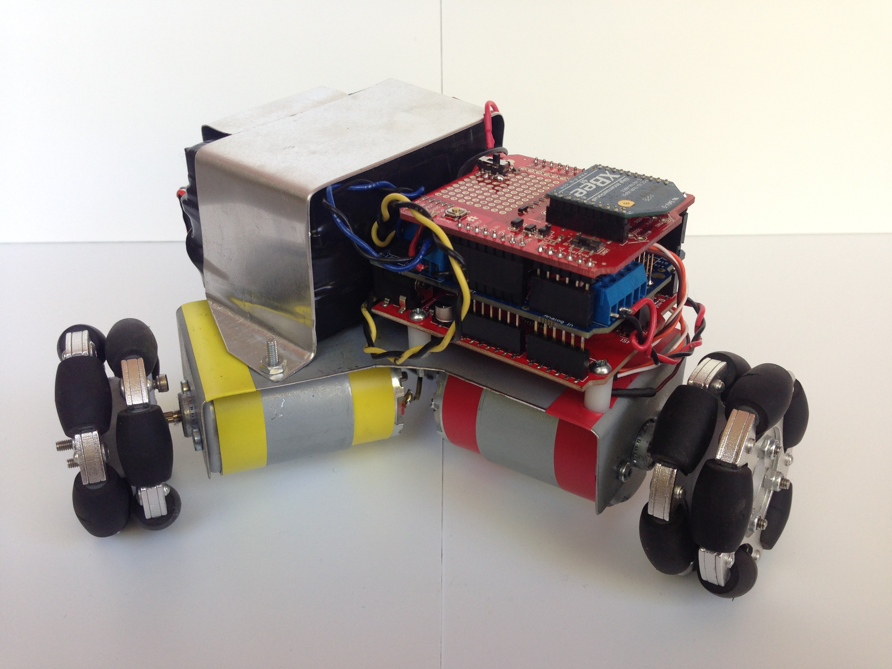

# kiwi-drive
This is a retrospective of a Freshman intro-to-engineering group project--specifically ME 122 at PSU in 2015.

## Project Summary
Tasked with creating an electromechanical system utilizing a microcontroller, our team decided to build a cute little robot.  The platform was based on the [kiwi drive](https://en.wikipedia.org/wiki/Kiwi_drive)--a triangular drive system with an omniwheel at each point.  This enables locomotion with three degrees of freedom: it can freely translate in any direction and spin in place.  The system is controlled by an Arduino Uno using the Adafruit Motor Shield and an XBee wireless transmitter.  A bent sheet metal chassis holds a 12 volt battery pack, a 9 volt battery, 3 small DC motors, and the electronic components.  An IR sensor was mounted above one of the wheels.  The latest version of the code sends the robot driving in a random direction until it detects an obstacle, at which point it begins to wander about in a new direction.

